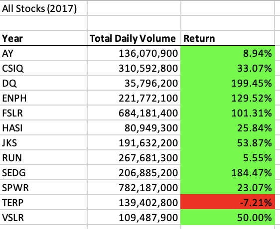
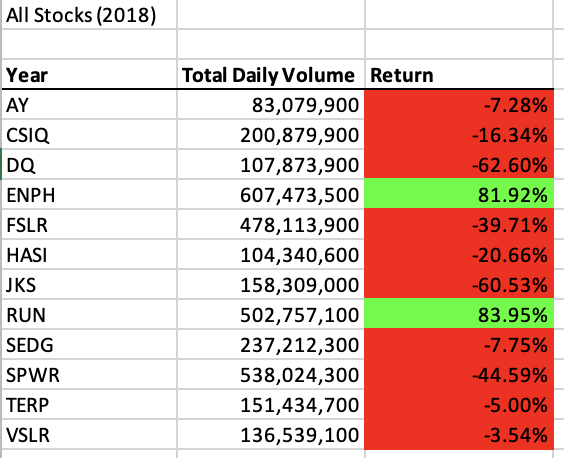

# Stock Analysis VBA

## Overview of Project

In this stock analysis project, the goal was to refactor the VBA module code to achieve an accurate analysis of both 2017 and 2018 stocks and compare them. Steve wanted to optimize the performance of analyzing stocks, and this was accomplished with VBA. By refactoring the code in the VBA macro, the goal was to increase efficiency by cutting down on redundancy and repetitveness in code by aiding VBA to circle through lines of code faster than in the original code before it was refactored. 

# Results

## 2017 Stocks vs. 2018 Stocks

When comparing the results of 2017 and 2018, there were more positive returns in 2017. In 2018, the only high returns were ENPH and RUN whereas in 2017, the only negative return was TERP. These results were simplified and easy to view for people like Steve because of the red and green color features. 

AY and SPWR were of the few to not have dropped so much from 2017 to 2018, however DQ and VSLR for example, dropped significantly. This is a good pointer for Steve to advise on where investments should and should not be made.

## Original vs. Refactored Script

Furthermore, when taking a look at the difference between the original module code to the refactored script, significant improvement was noted between the amount of seconds to run the stock analysis. 

When running the original code for the 2017 stock analysis, VBA in Excel would notify us that it took 0.0578125 seconds to run the code. 

The refactored 2017 code ran in 0.109375 seconds.

In addition, the original code in the 2018 analysis ran in 0.578125 seconds.

The refactored 2018 analysis code ran through in 0.140625. 

Therefore, there was a vast amount of improvement in the time it took to loop through the code for both 2017 and 2018 when comparing the original vs. refactored code. 

The line of code in 2b that looped over all the rows in the spreadsheet:
 
  For i = 2 To RowCount
 
was critical in the process of refactoring the code, because all in all helped increase the time taken for VBA to run through all the lines being taken into account for final calculations. 

# Summary

All in all, through this module's exercise for stock analysis, it was clear that refactoring the VBA code increased the cicling of code and could potentially be beneficial when dealing with larger amounts of data. Nevertheless, there are cons that come along with the pros that refactoring brings.

## Advantages

Refactoring code enables more data to be covered in a shorter amount of time, which is a positive thing when trying to be more time conscious and conservative with resources as well as storage. When dealing with original code, although it is more "step by step" and developed with greater ease, it can in the same way also be not as efficient since it will be longer. 

## Disadvantage

Since refactored code is a condensed version of original, longer code, it may be difficult to understand explanation for why certain things may be shortened or even ommited. There is a certain level of understanding necessary for developing refactored code, which in the long run could take longer when trying to figure out how to adapt original code to refactored as opposed to the time it may have taken simply running original code. 
